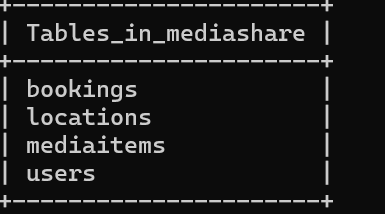
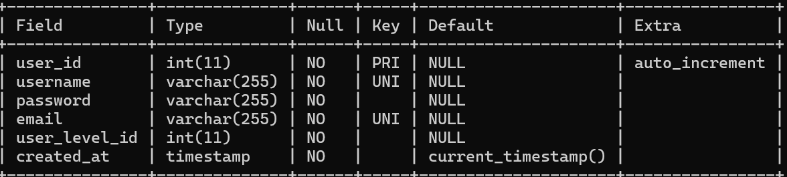
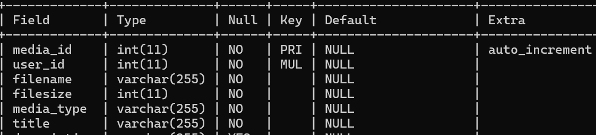
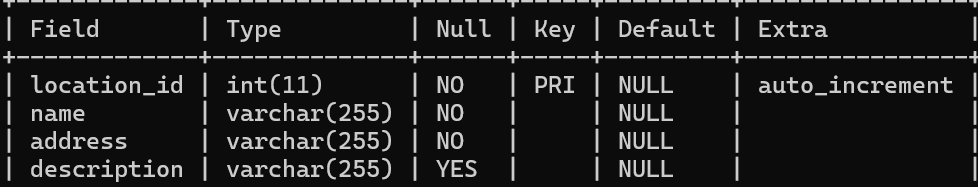
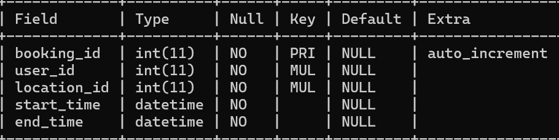
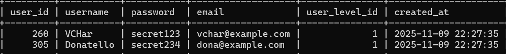
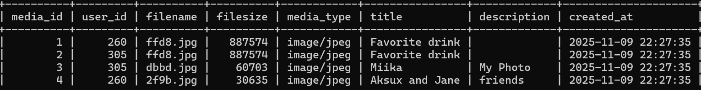
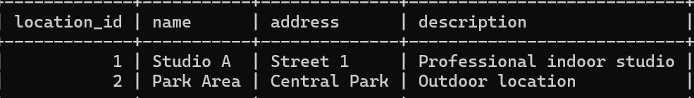
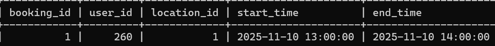
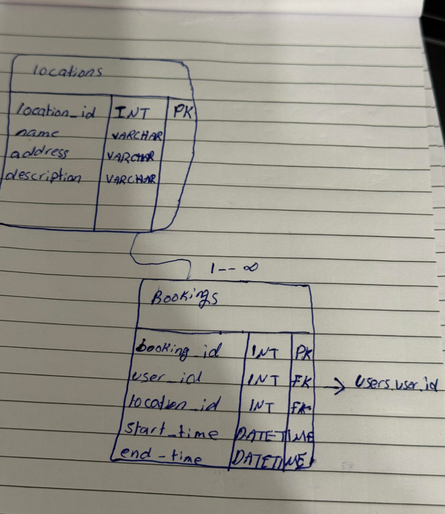

# Assignment 3A - Relational Databases

1.  Käytin tunnilla opittuja asioita tämän tehtävän toteuttamiseen. Lisäsin sovellukseen kaksi kokonaan uutta taulua (Locations ja Bookings), joita ei ollut valmiissa esimerkeissä.

2. Testasin ja tarkistin, että taulut luotiin oikein ja näkyvät MariaDB-tietokannassa.

3. Minulla oli aluksi paljon ongelmia MariaDB:n kanssa, koska en muistanut salasanaa. Sen selvittämiseen kului aikaa.
Lisäksi minulla oli ongelma, jossa VS Code ei yhdistänyt SQL-tiedostoa MariaDB:hen, koska polkua ei tunnistettu oikein.

------------------------
* SHOW DATABASES;
* USE mediashare;
* SHOW TABLES;

* DESCRIBE Users;

* DESCRIBE MediaItems;

* DESCRIBE Locations;

* DESCRIBE Bookings;

-------------------------------------------
näyttää data:
* SELECT * FROM Users;

* SELECT * FROM MediaItems;

* SELECT * FROM Locations;

* SELECT * FROM Bookings;

-----------------------------------
Users — MediaItems:
=> 1 käyttäjä voi omistaa monta mediaa

Users — Bookings:
=> 1 käyttäjä voi tehdä monta varausta

Locations — Bookings:
=> 1 paikka voi olla varattu monta kertaa

