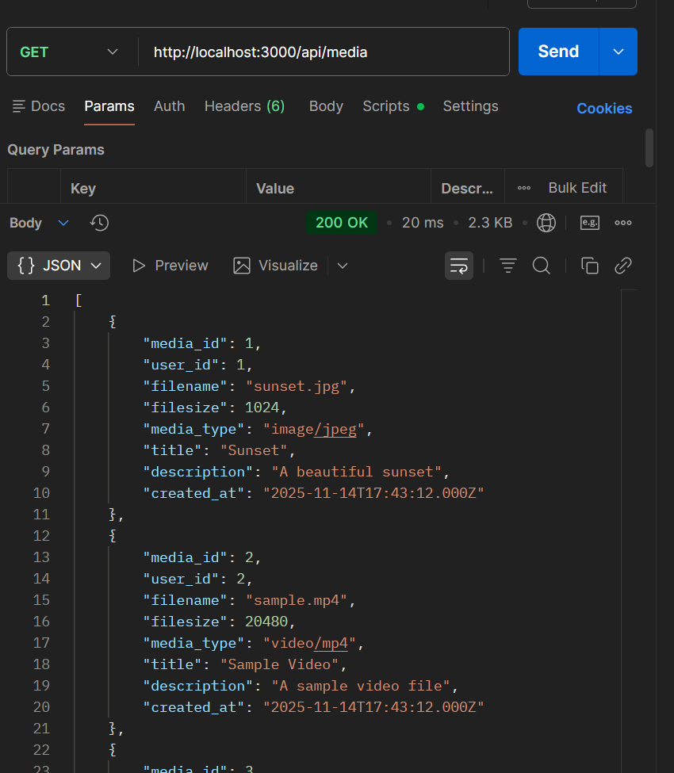
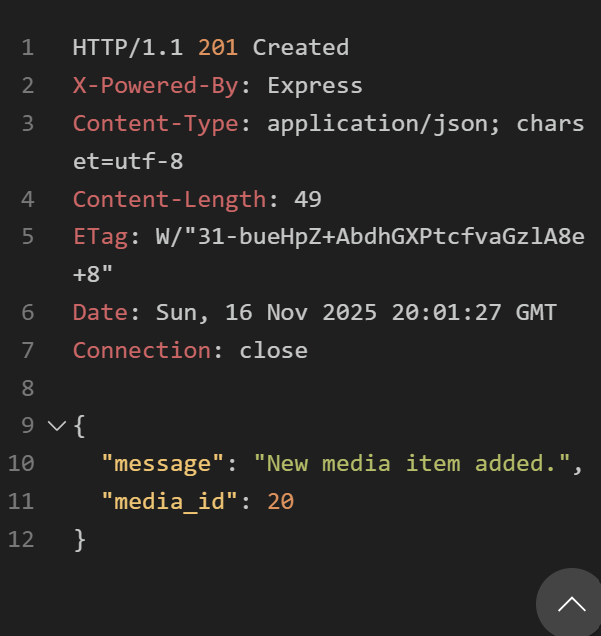

# MCV
- muutin tiedostojen rakeneetta mcv rakenteen perustella, jotta koodista tule selkämpi ja helpo muuta 
olin tehnyt:

1) Router
 => mitä toimintoa kutsuttan kun käytäjä menee tietun URL
* kun käyttäjä  menee /users url => router: Hei controller, hoida tämä pyyntö
* like-router.js 
* media-router.js 
* user-router.js 

2) Controllors kansio => päättä mitä tapahtuu käytäjän pyyntön jälkeen + pyydä tieto modelilta => tekee logiika => lähettä vstaus käytäjälle 
* like-controllers.js 
* media-controllers.js 
* user-controllers.js 

3) Models => teidot säity siellä
sieltä voidaan pyydä tietoja + muokka niitä
* like-models.js 
* media-models.js 
* user-models.js 

___________________________________________

# Media-toiminnallisuus: 
tein endpointit => listaus, tietyn median haku,  uuden median lisääminen, päivittäminen ja poistaminen
* Uuden median lisääminen tukee myös tiedoston latausta.
Toteutin sen multerilla, joka tallentaa tiedoston uploads-kansioon
ja tallentaa tiedoston nimen / tyypin / koon tietokantaan.

# Käyttäjätoiminnallisuus
Endpoint=>  GET kaikki käyttäjät, GET yksi käyttäjä, POST uuden käyttäjän lisäys,  PUT käyttäjän päivitys ja DELETE käyttäjän
=> Kaikki tiedot menevät MySQL-tietokantaan models-tiedostojen kautta. 

# like
lisä, poista, hakea media-id:n perusteella ja  hakea user-id:n perusteella
tein oman likes-model, -controller ja -router sekä oman Likes-taulun tietokantaan.

# testaus
MEDIA 
* GET http://localhost:3000/api/media

* GET http://localhost:3000/api/media/1

* POST http://localhost:3000/api/media

* PUT http://localhost:3000/api/media/1

USER
* GET http://localhost:3000/api/users

*

LIKES:

