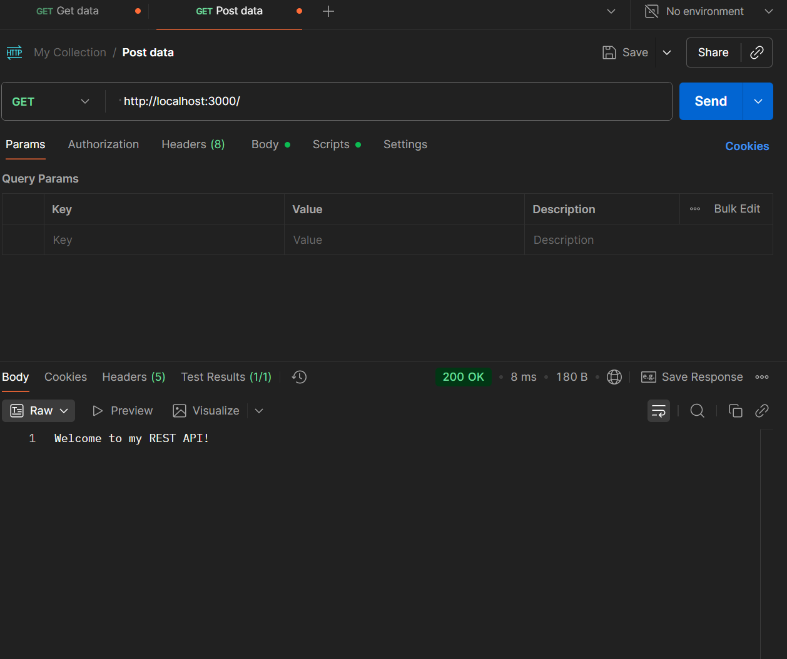

# Opettajan tuntiesimerkit + kotitehtävä
(main-harjoitus, init-versio)

## Mitä sain tehtyä

Toteutin seuraavat API-toiminnot:

1) GET / (server root) → palauttaa tekstin: "Welcome to my REST API!"
2) GET /items → palauttaa kaikki itemit
3) GET /items/:id → palauttaa yksittäisen itemin ID:n perusteella
4) POST /items → lisää uuden itemin
5) PUT /items/:id → päivittää olemassa olevan itemin
6) DELETE /items/:id → poistaa itemin

Lisäksi lisäsin kaksi lisätoiminnallisuutta:

- GET /items/random → palauttaa satunnaisen itemin  
- GET /items/count → laskee ja palauttaa, kuinka monta itemiä listassa on

Testasin kaikki reitit Postmanilla ja kaikki toimivat oikein.

---

## Ongelmia, joita kohtasin

- Aluksi POST-metodi ei toiminut, eikä se lähettänyt pyyntöä oikein.
- Koodin järjestyksessä oli ongelma: olin lisännyt uudet ominaisuudet (random ja count) väärään kohtaan koodin loppuun. Ne menivät ristiriitaan `GET /items/:id` -reitin kanssa, joten palvelin yritti tulkita ne ID:ksi.
  → Korjasin tämän siirtämällä ne oikeaan kohtaan ennen ID-reittiä.
- Unohdin aluksi lisätä uuden itemin POST-metodissa `items`-taulukkoon, joten se ei tallentunut listaan.

---

## Lopuksi

Kaikki API-reitit toimivat nyt oikein 

